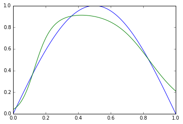
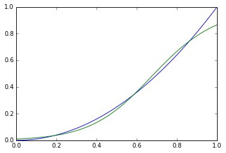
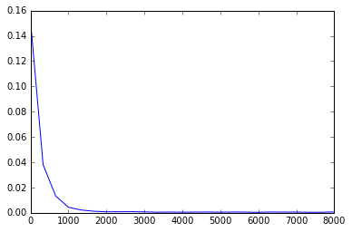
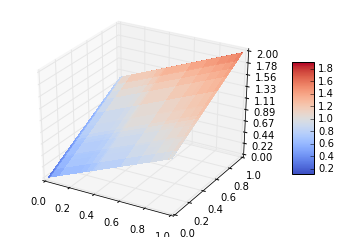

# Python实现的反向传播算法

### 参考资料：
* [一文弄懂神经网络中的反向传播法——BackPropagation](http://www.cnblogs.com/charlotte77/p/5629865.html)
* [反向传播算法-wiki](https://zh.wikipedia.org/wiki/%E5%8F%8D%E5%90%91%E4%BC%A0%E6%92%AD%E7%AE%97%E6%B3%95)

### 当`kind == 1`时 拟合 `y=sin(x * pi)`

(`蓝色：目标曲线`  `绿色：拟合结果`)
### 当`kind == 2`时 拟合 `y=x**2`

(↑ total loss)

### 当`kind == 3`时 拟合 `y=x1 + x2`

(↑ `y=x1 + x2`)
